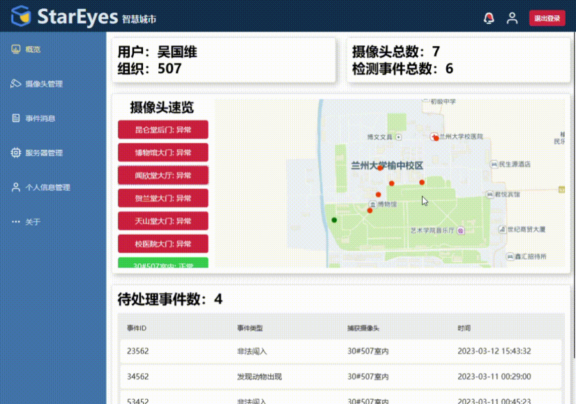

# StarEyes-GUI

***注：本项目已停止维护，后端服务器已下线，需要自行在 SE.Properties.cs 文件中进行配置以使用。***

## 项目概述

StarEyes 是一个流浪动物管理的解决方案，用于监测流浪动物的各类行为，实现了从监测到报警的完整管理闭环。

StarEyes-GUI 为 StarEyes 项目的C/S模块：**Windows客户端部分**。

StarEyes项目总架构图：

StarEyes-GUI 技术框架图：

## StarEyes-GUI 功能展示

登陆界面：

概览界面：

摄像头管理界面：

摄像头管理子菜单：

事件消息界面：

目前仅兼容支持RTSP协议的摄像头：

测试画面：

